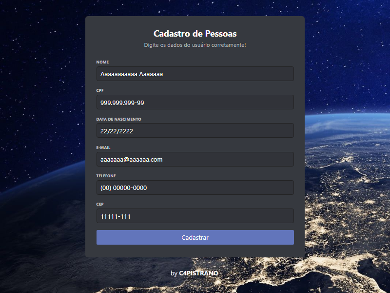

<h1 align="center">
  Form.dev
</h1>

  <a href="#-projeto">Projeto</a>&nbsp;&nbsp;&nbsp;|&nbsp;&nbsp;&nbsp;
  <a href="#-tecnologias">Tecnologias</a>&nbsp;&nbsp;&nbsp;|&nbsp;&nbsp;&nbsp;
  <a href="#earth_americas-publicação">Publicação</a>&nbsp;&nbsp;&nbsp;|&nbsp;&nbsp;&nbsp;
  <a href="#memo-licença">Licença</a>

 

  

 

  

## 💻 Projeto

O [Form.dev](https://c4pistrano.github.io/DW2A4/Atividades/A5) é uma demostracão de aplicação web com um formulário, onde foram utilizadas máscaras para controlar os formatos de entrada de dados. Foram utilizados módulos javascript para incluir máscaras, validar os campos inputs, criar classes e objetos baseados nos inputs. Máscaras de entrada podem ser utilizadas em campos de tabela, campos de consulta e controles em formulários e relatórios. 

A máscara de entrada é usada quando é importante que o formato dos valores de entrada sejam consistentes e válidos. Por exemplo, você pode usar uma máscara de entrada com um campo que armazena números de telefone, para que a aplicação exija a entrada de onze dígitos. Dessa forma, se alguém inserir um número de telefone sem o código de área, a aplicação não gravará os dados até que o código de área seja adicionado.
  
## 🚀 Tecnologias

Esse projeto foi desenvolvido utilizando as seguintes tecnologias:

- HTML
- CSS
- JavaScript

## :earth_americas: Publicação

Você pode acessar a página clicando em [Form.dev](https://c4pistrano.github.io/DW2A4/Atividades/A5) para testar a aplicação.

## :memo: Licença

Esse projeto está sob a licença MIT. Veja o arquivo [LICENSE](LICENSE.md) para mais detalhes.

---
Form.dev by [C4PISTRANO](https://github.com/C4PISTRANO)
