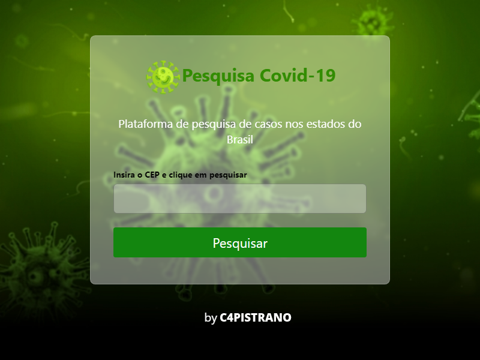

<h1 align="center">
  Pesquisa.Covid
</h1>

  <a href="#-projeto">Projeto</a>&nbsp;&nbsp;&nbsp;|&nbsp;&nbsp;&nbsp;
  <a href="#-tecnologias">Tecnologias</a>&nbsp;&nbsp;&nbsp;|&nbsp;&nbsp;&nbsp;
  <a href="#earth_americas-publicação">Publicação</a>&nbsp;&nbsp;&nbsp;|&nbsp;&nbsp;&nbsp;
  <a href="#memo-licença">Licença</a>

  
  

  

 

  

## 💻 Projeto

O [Pesquisa.Covid](https://c4pistrano.github.io/DW2A4/Atividades/A6) é uma página html criada para exibir os dados relacionados aos casos de COVID-19 de um determinado estado do Brasil, onde o usuário insere o CEP da região a ser pesquisada e recebe as informações sobre o estado ao qual o CEP pertence. Foram utilizados módulos e separação de conceitos, utilizando promise, async e await no JavaSCript.
  
## 🚀 Tecnologias

Esse projeto foi desenvolvido utilizando as seguintes tecnologias:

- <a href="https://developer.mozilla.org/pt-BR/docs/Learn/Getting_started_with_the_web/HTML_basics">HTML</a>
- <a href="https://developer.mozilla.org/pt-BR/docs/Web/CSS">CSS</a>
- <a href="https://developer.mozilla.org/pt-BR/docs/Web/JavaScript">Javascript</a>

## :earth_americas: Publicação

Você pode acessar e testar a página [Pesquisa.Covid](https://c4pistrano.github.io/DW2A4/Atividades/A6) para testar a aplicação.

## :memo: Licença

Esse projeto está sob a licença MIT. Veja o arquivo [LICENSE](LICENSE.md) para mais detalhes.

---
Pesquisa.Covid by [C4PISTRANO](https://github.com/C4PISTRANO)
